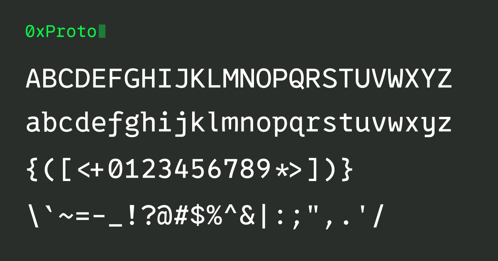
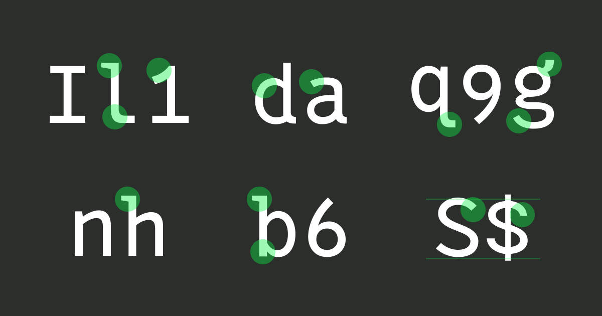
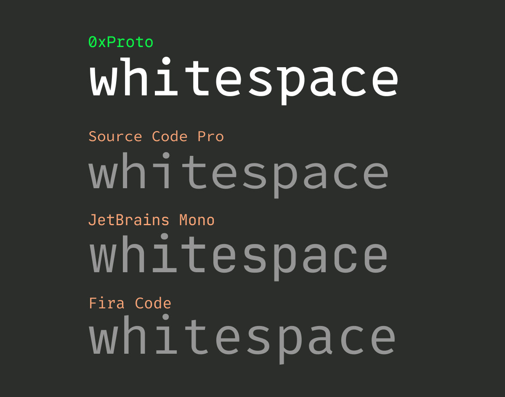

# 0xProto

[0xProto](https://github.com/0xType/0xProto) is a programming font focused on source code **legibility**.

Ensuring code **readability** is your own responsibility ;)

## Quick Q&A

**Q. Can I legally use 0xProto for my purpose?**

A. Most likely YES. 0xProto is free and open source. For details, [read the LICENSE](./LICENSE).

**Q. Where can I get 0xProto?**

A. [Here](https://github.com/0xType/0xProto/releases)

## Features

### 1. Clear differentiation

When it comes to programming fonts, legibility is paramount, particularly the clear differentiation of each letter.
Maintaining clarity in coding is critical as it minimizes ambiguity and helps prevent errors that could lead to software bugs.

0xProto is a cohesive font ingeniously designed to enhance differentiation between similar-looking letters.

### 2. Legibility in small font size

Software engineers often work with fonts in small print on their preferred text editor or terminal software. Thus, we've adjusted the font to ensure that the interior of each character is sufficiently wide to be easily visible, even at smaller font sizes.

Additionally, there's a feature called [Texture Healing](https://github.com/githubnext/monaspace/blob/main/docs/Texture%20Healing.md) that enhances the legibility of naturally wide characters like `m`.
This feature slightly widens characters like `m` to improve legibility when they're next to narrower characters like `i` and `l`, or symbols like periods, colons, and spaces, while still keeping them within their monospace width. GitHub incorporates this feature in '[monaspace](https://github.com/githubnext/monaspace)'.

### 3. More whitespace

Compared to regular typefaces, monospaced fonts often exhibit uneven distribution of dark and light spaces. 0xProto effectively mitigates this issue by employing unique letter shapes to maintain visual balance.

### 4. Ligatures that DON'T deform shape

Software engineers frequently use a variety of symbols while programming.

As [Fira Code suggests](https://github.com/tonsky/FiraCode#problem), sequences such as `:=` or `=>` function as single logical tokens, even though they are composed of two characters on the screen.
However, many programming fonts, such as Fira Code, use ligatures, for example, to change the appearance of `!=` to change its appearance to `≠` and other ligatures. Although `!=` is commonly used to represent `≠` in many programming languages, in my view, ligatures that alter the original meaning do not truly fit the definition of "ligatures".

From a functional or usability standpoint, ligatures that transform the meaning of `≠` or other overly distorted ligatures make it challenging to anticipate their meaning if any part of the string is erased.

For these reasons, 0xProto has made a conscious decision to abstain from using ligatures that modify both meaning and form.

If you prefer the programming ligature so far, I recommend Fira Code because it is very clean and useful!

## OpenType features

### Script Variant (`ss01`)

In the Italic family of 0xProto, some characters can be changed to script.

How to enable:

- [Visual Stuio Code](https://github.com/microsoft/vscode/issues/84018)
- [other tools](https://github.com/tonsky/FiraCode/wiki/How-to-enable-stylistic-sets)
  - This is a Fira Code document; the Script Variant for 0xProto is `ss01`.

## Installation

1. Download font files
1. Unzip the archive and install the font:
    - macOS: Drag & Drop the font file to Font Book (or the other font management app)
    - Windows: right-click any of them, then pick `Install` from the menu

## How to use

### Visual Studio Code

1. Open `Settings`
1. Go `Text Editor` -> `Font` -> `Font Family`
1. Input box type: `"0xProto"` (Enclose `0xProto` in quotation marks `'` or double quotation marks `"`.)

To enable ligatures:

1. Go `Text Editor` -> `Font` -> `Font Ligatures`
1. Click `Edit in settings.json`
1. Change `"editor.fontLigatures"` to `true` in `settings.json`

## License

The SIL Open Font License, Version 1.1

Copyright (c) 2024 [0xType](https://0xtype.dev)